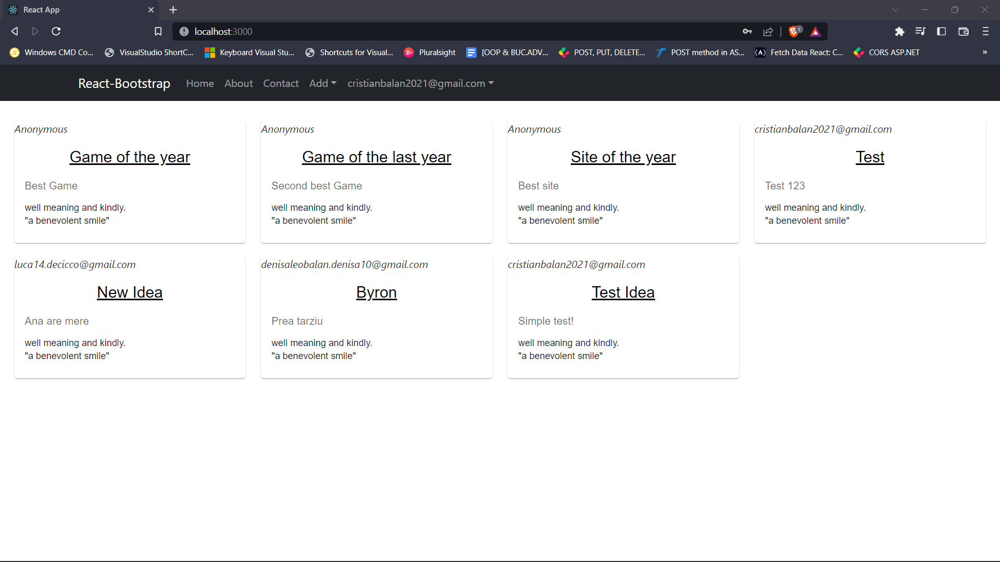
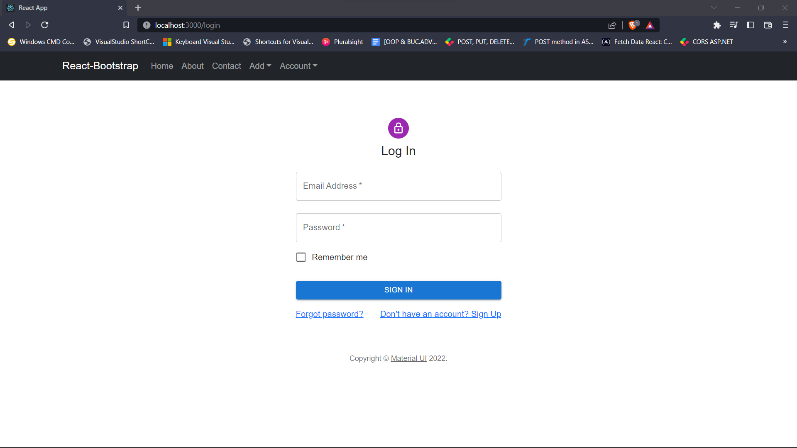
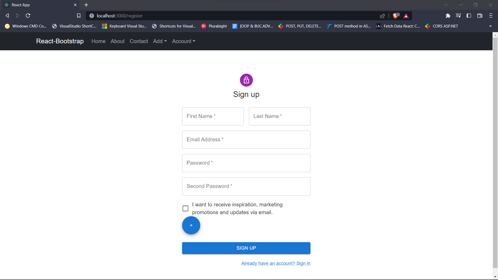
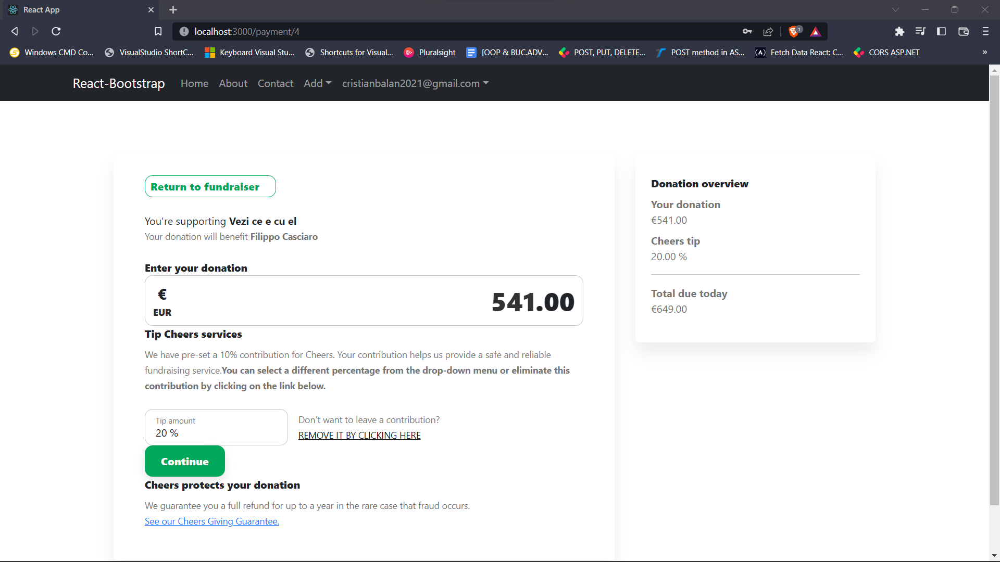

## Cheers

### About the Project:

- Cheers is a Crowd Founding-based Web Application that can help
  other people to bring their dreams or ideas to reality. As a user,
  you can see other users' ideas and choose to found them by paying a
  small amount from the total price.

### Used technologies:
#### Backend technologies:
1. [C#](https://learn.microsoft.com/en-us/dotnet/csharp/)
2. [ASP.NET CORE Framework](https://learn.microsoft.com/en-us/aspnet/core/introduction-to-aspnet-core?view=aspnetcore-7.0)
3. [MicrosoftSQL Server](https://learn.microsoft.com/en-us/sql/sql-server/?view=sql-server-ver16)
4. [Entity Framework](https://learn.microsoft.com/en-us/ef/)
5. [Identity](https://learn.microsoft.com/en-us/aspnet/core/security/authentication/identity?view=aspnetcore-7.0&tabs=visual-studio)

#### Frontend technologies:
1. [React](https://reactjs.org/)
2. [Redux](https://redux.js.org/)
3. [Bootstrap](https://getbootstrap.com/)
4. [Material UI,](https://mui.com/)
5. [HTML](https://en.wikipedia.org/wiki/HTML)
6. [CSS](https://en.wikipedia.org/wiki/CSS)

### Project Features:
- Site manages to complete a _payment intent_ using __[Stripe Api](https://dashboard.stripe.com/login?redirect=%2Ftest%2Fdashboard)__
- Application uses [MicrosoftSQL Server](https://en.wikipedia.org/wiki/Microsoft_SQL_Server) Server for persistence
- Every user that chooses to make an account on our platform also receive a mail confirmation
- For every payment that is completed user receives a mail confirmation

### Security
- All project routes are secured with Microsoft Identity
framework. The JWT token that is generated is stored in 
the application local storage with JavaScript.
The secret key is stored in application.properties.
- We managed to add two types of users:
1. admin
2. simple user

- Admin user can manage easily ideas created by other users

### How to Run the Project?
- Clone the Repo: [Cheers Project](https://github.com/BalanC21/Cheers)
#### Backend:
1. You only should to run the application.
#### Frontend:
1. You’ll need to have [Node](https://nodejs.org/en/)
2. npm install
3. npm start

